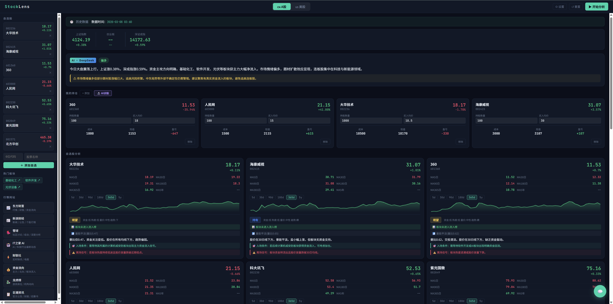
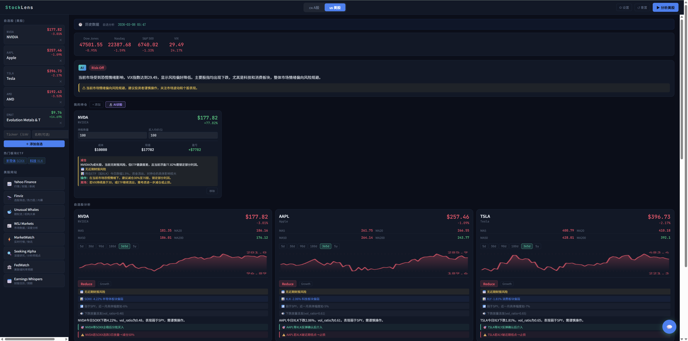

# StockLens · 智能股票分析

> 🇨🇳 A股（DeepSeek）+ 🇺🇸 美股（GPT-4o-mini）双市场 AI 分析工具

实时爬取行情数据，结合 AI 对自选股、持仓、市场机会做全面分析，一个页面同时管理 A 股和美股。

| A股页面 | 美股页面 |
|---|---|
|  |  |

---

## 🚀 快速开始

### 1. 安装依赖

```bash
pip install flask yfinance openai requests
```

### 2. 启动

```bash
python app.py
```

浏览器打开 [http://localhost:5000](http://localhost:5000)，在右上角「⚙ 设置」中填入 API Key，即可开始分析。

### 3. 填入 API Key

浏览器打开 [http://localhost:5000](http://localhost:5000)，点右上角「⚙ 设置」填入 API Key 即可，程序会自动保存，无需手动创建文件。

| Key | 用途 | 获取地址 |
|---|---|---|
| DeepSeek API Key | A股分析 + 政策主线 + A股聊天 | [platform.deepseek.com](https://platform.deepseek.com) |
| OpenAI API Key | 美股分析 + 美股诊股 + 美股聊天 | [platform.openai.com](https://platform.openai.com) |

---

## 📁 目录结构

```
stock_agent/
├── app.py                  ← 单文件，运行这个
├── README.md
├── .gitignore
├── figure/
│   ├── chinse_stock_page.png
│   └── us_stock_page.png
└── data/                   ← 首次运行自动创建
    ├── china/              ← A股数据
    │   ├── deepseek_key.txt        ← A股 AI Key
    │   ├── config.json             ← A股自选股
    │   ├── portfolio.json          ← A股持仓
    │   ├── virtual_portfolio.json  ← A股虚拟炒股持仓
    │   ├── virtual_account.json    ← A股虚拟账户资金
    │   ├── .status.json            ← 运行状态（临时）
    │   ├── archive/                ← A股历史分析（含诊股，保留14天/最多50份）
    │   └── policy/                 ← 政策主线数据
    │       ├── .status.json
    │       └── latest.json         ← 最新一次政策分析（单文件覆盖）
    └── us/                 ← 美股数据
        ├── openai_key.txt          ← 美股 AI Key
        ├── config.json             ← 美股自选股
        ├── portfolio.json          ← 美股持仓
        ├── virtual_portfolio.json  ← 美股虚拟炒股持仓
        ├── .status.json            ← 运行状态（临时）
        └── archive/                ← 美股历史分析（含诊股，保留14天/最多50份）
```

> ⚠️ 请将 `data/` 加入 `.gitignore`，避免 API Key 泄露。

---

## ✨ 功能概览

### 🇨🇳 A股（DeepSeek）

- **自选股分析** — 实时抓取大盘、板块资金流向、涨幅榜、连板股，AI 逐一给出入场条件与止损信号
- **持仓诊断** — 自动计算浮盈浮亏，AI 一键诊断所有持仓，给出持有 / 加仓 / 减仓 / 止损建议
- **🎮 虚拟炒股** — 模拟实盘环境，无需真实资金即可建仓、记录成本，享有与实盘相同的 AI 诊股能力；支持一键将实盘持仓复制为虚拟持仓
- **AI 荐股** — 基于东方财富主力净流入 Top30 候选池，防幻觉机制确保推荐有真实数据支撑
- **🏛 政策主线** — 对 AI算力、半导体、人形机器人、商业航天、军工、创新药、有色金属七大方向做中长线周期判断

---

### 🇺🇸 美股（GPT-4o-mini）

- **自选股分析** — 以财报风险为第一优先，结合板块 ETF 动能、相对强度、VIX 给出操作建议
- **持仓诊断** — 按股票类型分类，结合财报日历、ETF 健康度、VIX 仓位管理给出个性化建议
- **🎮 虚拟炒股** — 同 A股，模拟建仓与 AI 诊股，与实盘数据完全隔离，互不干扰
- **AI 荐股** — 基于 Yahoo Finance 涨幅榜 + 成交量榜候选池，候选不足时自动补充 S&P 500 成分股

---

## 🧠 A股 vs 美股 核心差异

| | 🇨🇳 A股 | 🇺🇸 美股 |
|---|---|---|
| 最大风险 | 板块情绪退潮、游资撤退 | 财报暴雷 |
| 核心节奏 | 题材热度周期（天级别） | 财报周期（季度级别） |
| 止损第一优先 | 放量下跌 / 板块退潮 | 财报 EPS 低于预期 |
| 推荐候选池来源 | 东方财富主力净流入 Top30 | Yahoo 涨幅榜 + 成交量榜 Top40 |
| AI 模型 | DeepSeek `deepseek-chat` | GPT-4o-mini |
| 单次分析费用 | ~ $0.001~0.003 | ~ $0.01~0.03 |

---

## 🎮 虚拟炒股说明

虚拟炒股与实盘持仓、自选股**完全独立**，三者数据互不干扰。

- **建仓**：手动输入股票代码、数量、买入均价，或一键将实盘持仓复制过来
- **买入累加**：同一只股票多次买入时，自动按加权平均计算新成本价
- **AI 诊股**：使用与实盘完全相同的 prompt 逻辑，给出持有 / 加仓 / 减仓 / 止损建议
- **数据持久化**：虚拟持仓单独保存，重启程序后自动恢复，下次打开继续使用

---

## 💬 AI 投资顾问（对话）

右下角 💬 按钮，市场感知对话：

- **A股模式（绿色）**：问板块热点、政策解读、操作建议
- **美股模式（蓝色）**：问财报日历、ETF轮动、VIX仓位管理

AI 会自动带入当次分析的市场数据、自选股涨跌、持仓列表作为上下文。

---

## ⚙️ 使用流程

```
左侧切换市场（A股 / 美股）
         ↓
添加自选股（A股6位代码 / 美股Ticker）
         ↓
右上角「▶ 开始分析」（约30~90秒）
         ↓
查看 AI摘要 → 持仓诊断 → 自选股分析 → 推荐 → 今日要闻
         ↓
持仓用户：点「🔬 AI诊股」获取每只持仓的操作建议
         ↓
练手用户：在「🎮 虚拟炒股」区域模拟建仓，同样可触发 AI 诊股
```

---

## 📌 注意事项

- 分析卡住不动 → 点右上角「↺ 重置」后重试，或删除 `data/china/.status.json` / `data/us/.status.json` 后重启
- 历史结果自动保存在 `archive/`，保留最近 14 天 / 最多 50 份
- 政策主线分析约需 60~90 秒，独立触发
- 虚拟炒股数据保存在 `virtual_portfolio.json`，与实盘 `portfolio.json` 完全隔离
- **本工具仅供参考，不构成投资建议，投资有风险，入市须谨慎**

---

## ☕ 支持作者

如果觉得这个工具不错，欢迎打赏支持 🙏


---

## 🛠️ 技术栈

| 层 | 技术 |
|---|---|
| 后端 | Python 3.10+ · Flask |
| A股 AI | DeepSeek `deepseek-chat` |
| 美股 AI | OpenAI `gpt-4o-mini` |
| 行情（A股） | 东方财富 API（实时）+ yfinance（历史） |
| 行情（美股） | Yahoo Finance Screener（实时）+ yfinance（历史） |
| 前端 | 原生 HTML / CSS / JS，内嵌在 `app.py`，无需 Node.js |