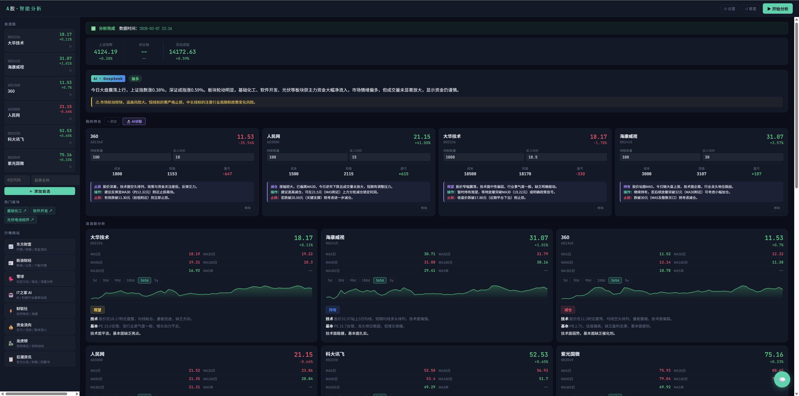

# 📈 A股智能分析

基于 DeepSeek AI + 实时行情数据的 A 股分析工具。自动爬取大盘、涨幅榜、板块资金流向、连板数据，结合 AI 分析自选股并给出短线/中长线推荐。



---

## 🚀 快速开始

### 1. 安装依赖

```bash
pip install flask yfinance openai requests
```

| 库 | 用途 |
|---|---|
| `flask` | Web 后端服务 |
| `yfinance` | 爬取个股/大盘历史行情 |
| `openai` | 调用 DeepSeek API |
| `requests` | 爬取东方财富实时数据 |

### 2. 获取 DeepSeek API Key

前往 [platform.deepseek.com](https://platform.deepseek.com) 注册并创建 API Key。

### 3. 启动

```bash
python app.py
```

浏览器打开 [http://localhost:5000](http://localhost:5000)，在右上角「⚙ 设置」中填入 API Key，点击「▶ 开始分析」即可。

---

## 📁 目录结构

```
stock_agent/
├── app.py              ← 单文件，运行这个
├── README.md
├── .gitignore          ← 建议添加，避免泄露 Key
├── figure/
│   └── ScreenShot_2026-03-07_233554_270.png
└── data/               ← 首次运行自动创建，无需手动创建
    ├── deepseek_key.txt    ← API Key 存储文件（见下方说明）
    ├── config.json         ← 自选股列表
    ├── portfolio.json      ← 持仓数据
    ├── .status.json        ← 分析运行状态（临时文件）
    └── archive/            ← 历史分析结果
        └── analysis_YYYYMMDD_HHMMSS.json
```

### data 目录文件说明

#### 🔑 `deepseek_key.txt`
存储你的 DeepSeek API Key，通过界面「⚙ 设置」填写后自动生成，内容为纯文本一行：
```
sk-xxxxxxxxxxxxxxxxxxxxxxxx
```
> ⚠️ **请勿将此文件上传到 GitHub 或任何公开平台**，泄露后他人可消费你的 API 额度。
> 建议在 `.gitignore` 中添加：
> ```
> data/deepseek_key.txt
> data/
> ```

#### 📋 `config.json`
自选股列表，界面操作后自动更新，格式如下：
```json
{
  "watchlist": [
    {"code": "002236", "name": "大华技术"},
    {"code": "002415", "name": "海康威视"}
  ]
}
```

#### 💼 `portfolio.json`
持仓数据，记录每只股票的持股数量和买入均价：
```json
{
  "002236": {
    "name": "大华技术",
    "quantity": 1000,
    "avg_price": 18.50
  }
}
```

#### ⚙️ `.status.json`
分析任务的运行状态文件，程序自动维护，无需手动修改。分析中为 `{"status":"running"}`，完成后写入完整结果。若程序异常退出导致卡住，删除此文件后重启即可。

#### 🗂️ `archive/analysis_YYYYMMDD_HHMMSS.json`
每次分析完成后按时间戳保存的完整结果，例如 `analysis_20260307_143022.json`。程序自动清理超过 14 天或超过 50 份的旧文件。

---

## ✨ 功能介绍

### 📊 大盘概览
实时显示上证指数、深证成指、创业板指数的涨跌幅。

### 🔍 自选股分析
- 左侧添加 6 位股票代码，重新分析后自动展示
- 每只股票显示：当前价、涨跌幅、MA5/30/90/180/365 均线、K线走势图（可切换5日/30日/1年/5年）
- AI 结合实时市场数据给出：
  - **趋势判断**：强势 / 震荡 / 弱势
  - **均线位置**：MA5/MA30 上方多头 / MA30 下方空头
  - **板块热度**：该股所在板块今日是否有主力资金流入
  - **入场区间**：具体建议介入价位
  - **止损参考**：明确止损价或止损条件

### 💼 我的持仓
- 添加持仓股票、买入均价、持股数量
- 自动计算成本、现值、盈亏金额和盈亏百分比
- **🔬 AI 诊股**：一键对所有持仓逐一诊断，给出持有/加仓/减仓/止损建议和具体操作
  - 浮盈 >15%：提示是否分批止盈
  - 浮亏 5~8%：给出补仓条件
  - 浮亏 >8% 且破 MA30：建议止损，**禁止给出"等反弹"**

### ⚡ AI 今日推荐
基于以下**实时爬取数据**生成推荐，而非仅依赖 AI 训练数据：

| 实时数据 | 来源 |
|---|---|
| A 股涨幅榜 Top 15（含量比） | 东方财富 |
| 板块主力资金净流入 Top 8 | 东方财富 |
| 连板股/情绪指标 | 东方财富 |
| 上证/深证/创业板指数 | yfinance |
| 财经新闻 | 新浪财经 |

推荐分两个区块：
- **⚡ 短线推荐**：1~2 周内，优先从涨幅榜/连板股中选，必须给出止损位
- **📈 中长线推荐**：优先从资金净流入板块中选，政策+基本面共振

> 推荐逻辑：实时资金 > 市场情绪 > 政策共振。若仅有政策方向而无资金流入，不推荐。

---

## 🧠 三个 AI 模块的分析逻辑

三个模块视角完全不同，互相补充：

| 模块 | 核心问题 | 分析优先级 |
|---|---|---|
| 🔍 自选股分析 | 这只股票现在**值不值得买？** | 技术位置 → 板块资金热度 → 市场情绪 → 政策 |
| 💼 AI 诊股 | 我已经持仓，现在**该怎么办？** | 止损纪律 → 技术位置 → 市场情绪 → 政策 |
| ⚡ AI 推荐 | 市场上现在**有什么新机会？** | 实时资金流入 → 市场情绪/连板 → 政策共振 |

推荐发现机会 → 加入自选股观察 → 买入后用持仓诊断管理，形成完整闭环。

### 💬 AI 投资顾问（对话）
右下角 💬 按钮打开对话窗口，可自由提问：选股逻辑、政策解读、止损位设置等。AI 会结合本次分析的市场数据回答。

### 🌐 行情网站快捷入口
左侧栏集成常用网站：东方财富、新浪财经、雪球、财联社、资金流向、龙虎榜、巨潮资讯等，一键跳转。

---

## ⚙️ 使用流程

```
1. 左侧添加自选股（6位代码 + 名称）
         ↓
2. 点击右上角「▶ 开始分析」
         ↓
3. 等待 30~90 秒（爬取行情 + AI 分析）
         ↓
4. 查看大盘、自选股分析、AI推荐、财经新闻
         ↓
5. 持仓用户：点「🔬 AI诊股」获取每只持仓的操作建议
```

---

## 📌 注意事项

- 分析费用约 **$0.05~0.10 / 次**（DeepSeek API 按 token 计费，非常便宜）
- 如果分析卡住不动，点右上角「↺ 重置」后重试
- 历史分析结果自动保存在 `data/archive/`，保留最近 14 天 / 最多 50 份
- **本工具仅供参考，不构成投资建议，投资有风险，入市须谨慎**

---

## 🛠️ 技术栈

- **后端**：Python 3.10+ / Flask
- **AI**：DeepSeek `deepseek-chat` 模型
- **行情**：yfinance（历史数据）+ 东方财富 API（实时数据）
- **前端**：原生 HTML/CSS/JS，内嵌在 `app.py` 中，无需 Node.js